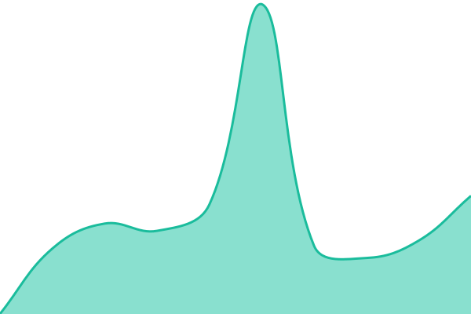
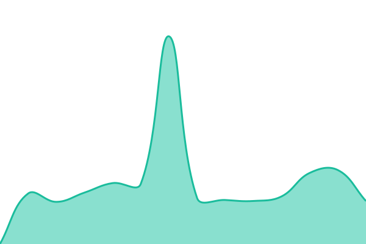
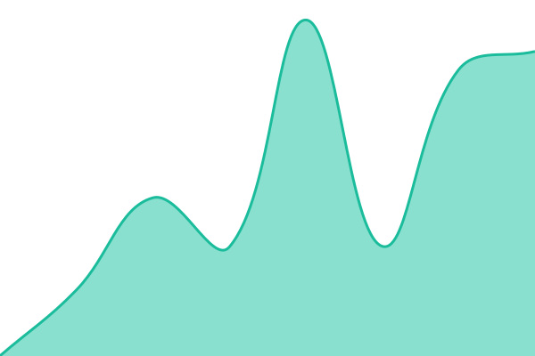
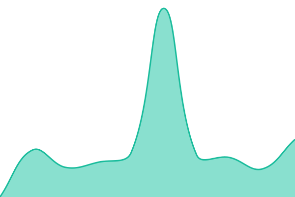
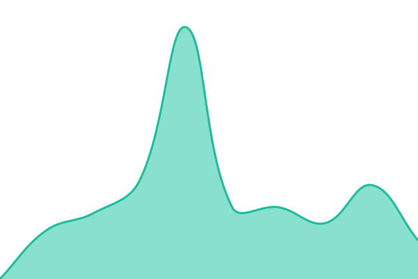

# [📈 Live Status](https://status.fasrv.ch): <!--live status--> **🟩 All systems operational**

This repository contains the open-source uptime monitor and status page for [Nikoheld](https://status.fasrv.ch), powered by [Upptime](https://github.com/upptime/upptime).

With [Upptime](https://upptime.js.org), you can get your own unlimited and free uptime monitor and status page, powered entirely by a GitHub repository. We use [Issues](https://github.com/Nikoheld/fasrv-status/issues) as incident reports, [Actions](https://github.com/Nikoheld/fasrv-status/actions) as uptime monitors, and [Pages](https://status.fasrv.ch) for the status page.

<!--start: status pages-->
<!-- This summary is generated by Upptime (https://github.com/upptime/upptime) -->
<!-- Do not edit this manually, your changes will be overwritten -->
<!-- prettier-ignore -->
| URL | Status | History | Response Time | Uptime |
| --- | ------ | ------- | ------------- | ------ |
|  [FASRV Dashboard](https://fasrv.ch) | 🟩 Up | [fasrv-dashboard.yml](https://github.com/Nikoheld/fasrv-status/commits/HEAD/history/fasrv-dashboard.yml) | 

 205ms
     
 | 

<a href="https://status.fasrv.ch/history/fasrv-dashboard">100.00%</a>
    

|  [Home Assistant](https://home.fasrv.ch) | 🟩 Up | [home-assistant.yml](https://github.com/Nikoheld/fasrv-status/commits/HEAD/history/home-assistant.yml) | 

 891ms
     
 | 

<a href="https://status.fasrv.ch/history/home-assistant">99.77%</a>
    

|  [Jellyfin](https://jellyfin.fasrv.ch/health) | 🟩 Up | [jellyfin.yml](https://github.com/Nikoheld/fasrv-status/commits/HEAD/history/jellyfin.yml) | 

 868ms
     
 | 

<a href="https://status.fasrv.ch/history/jellyfin">99.75%</a>
    

|  [Jellyseerr](https://jellyseerr.fasrv.ch/api/v1/status) | 🟩 Up | [jellyseerr.yml](https://github.com/Nikoheld/fasrv-status/commits/HEAD/history/jellyseerr.yml) | 

 1001ms
     
 | 

<a href="https://status.fasrv.ch/history/jellyseerr">99.76%</a>
    

|  [Immich](https://galerie.fasrv.ch/api/server/ping) | 🟩 Up | [immich.yml](https://github.com/Nikoheld/fasrv-status/commits/HEAD/history/immich.yml) | 

 817ms
     
 | 

<a href="https://status.fasrv.ch/history/immich">99.76%</a>
    

|  [Share](https://share.fasrv.ch) | 🟩 Up | [share.yml](https://github.com/Nikoheld/fasrv-status/commits/HEAD/history/share.yml) | 

 735ms
     
 | 

<a href="https://status.fasrv.ch/history/share">99.78%</a>
    

|  [File Tools](https://tools.fasrv.ch) | 🟩 Up | [file-tools.yml](https://github.com/Nikoheld/fasrv-status/commits/HEAD/history/file-tools.yml) | 

 847ms
     
 | 

<a href="https://status.fasrv.ch/history/file-tools">99.79%</a>
    

|  [Software](https://software.fasrv.ch) | 🟩 Up | [software.yml](https://github.com/Nikoheld/fasrv-status/commits/HEAD/history/software.yml) | 

 890ms
     
 | 

<a href="https://status.fasrv.ch/history/software">99.79%</a>
    

|  [Codex Web](https://codex.fasrv.ch) | 🟩 Up | [codex-web.yml](https://github.com/Nikoheld/fasrv-status/commits/HEAD/history/codex-web.yml) | 

 139ms
     
 | 

<a href="https://status.fasrv.ch/history/codex-web">100.00%</a>
    

|  [Kavita](https://kavita.fasrv.ch) | 🟩 Up | [kavita.yml](https://github.com/Nikoheld/fasrv-status/commits/HEAD/history/kavita.yml) | 

 860ms
     
 | 

<a href="https://status.fasrv.ch/history/kavita">99.79%</a>
    

|  [HiAnime Downloader](https://hianime-downloader.fasrv.ch) | 🟩 Up | [hi-anime-downloader.yml](https://github.com/Nikoheld/fasrv-status/commits/HEAD/history/hi-anime-downloader.yml) | 

 917ms
     
 | 

<a href="https://status.fasrv.ch/history/hi-anime-downloader">99.80%</a>
    

|  [Uptime Kuma](https://kuma.fasrv.ch) | 🟩 Up | [uptime-kuma.yml](https://github.com/Nikoheld/fasrv-status/commits/HEAD/history/uptime-kuma.yml) | 

 1231ms
     
 | 

<a href="https://status.fasrv.ch/history/uptime-kuma">99.80%</a>
    

|  [Fahoot](https://fahoot.fasrv.ch) | 🟩 Up | [fahoot.yml](https://github.com/Nikoheld/fasrv-status/commits/HEAD/history/fahoot.yml) | 

 793ms
     
 | 

<a href="https://status.fasrv.ch/history/fahoot">99.80%</a>
    

|  [FabioHub](https://fabiohub.fasrv.ch) | 🟩 Up | [fabio-hub.yml](https://github.com/Nikoheld/fasrv-status/commits/HEAD/history/fabio-hub.yml) | 

 757ms
     
 | 

<a href="https://status.fasrv.ch/history/fabio-hub">97.82%</a>
    

|  [RedAlpine](https://redalpine.fasrv.ch) | 🟩 Up | [red-alpine.yml](https://github.com/Nikoheld/fasrv-status/commits/HEAD/history/red-alpine.yml) | 

 759ms
     
 | 

<a href="https://status.fasrv.ch/history/red-alpine">99.81%</a>
    

|  [BG Fabio and Simon](https://bg.fasrv.ch) | 🟩 Up | [bg-fabio-and-simon.yml](https://github.com/Nikoheld/fasrv-status/commits/HEAD/history/bg-fabio-and-simon.yml) | 

 871ms
     
 | 

<a href="https://status.fasrv.ch/history/bg-fabio-and-simon">99.81%</a>
    

|  [Animation Fabio](https://fabiobg.fasrv.ch) | 🟩 Up | [animation-fabio.yml](https://github.com/Nikoheld/fasrv-status/commits/HEAD/history/animation-fabio.yml) | 

 882ms
     
 | 

<a href="https://status.fasrv.ch/history/animation-fabio">99.82%</a>
    

<!--end: status pages-->

[**Visit our status website →**](https://status.fasrv.ch)

## 📄 License

- Powered by: [Upptime](https://github.com/upptime/upptime)
- Code: [MIT](./LICENSE) © [Anand Chowdhary](https://anandchowdhary.com)
- Data in the `./history` directory: [Open Database License](https://opendatacommons.org/licenses/odbl/1-0/)
